### Reflection

**1. What is the difference between the approach of performance testing with JMeter and profiling with IntelliJ Profiler in the context of optimizing application performance?**

Performance testing with JMeter approaches the application from the *outside*. It simulates real-world conditions by sending multiple concurrent requests (like the 10 users you configured) to see how the system performs under load, measuring metrics like response time, throughput, and error rates. Profiling with IntelliJ Profiler approaches the application from the *inside*. It attaches to the JVM to monitor the internal execution of the code, pinpointing exactly which methods, loops, or database queries are consuming the most CPU time and memory. JMeter tells you *if* your application is slow, while the Profiler tells you exactly *why* it is slow.

**2. How does the profiling process help you in identifying and understanding the weak points in your application?**

The profiling process removes the guesswork from optimization. By recording the execution and generating tools like Flame Graphs and Call Trees, it visually highlights exactly where the application spends its time. For example, during this assignment, the profiler proved that the weak points were not the database connection itself, but specific inefficient methods (like the N+1 loop in `getAllStudentsWithCourses` and the massive memory allocation in `joinStudentNames`). It allows you to see the exact line of code causing the bottleneck.

**3. Do you think IntelliJ Profiler is effective in assisting you to analyze and identify bottlenecks in your application code?**

Yes, it is highly effective. Its tight integration with the IDE means you can find a slow method in the profiling results and immediately click to jump straight to that source code. Furthermore, it cleanly separates "Total Time" (which includes waiting for the database) from "CPU Time" (active processing), making it very easy to distinguish between I/O bottlenecks and algorithmic inefficiencies in your Java code.

**4. What are the main challenges you face when conducting performance testing and profiling, and how do you overcome these challenges?**

One major challenge is the "cold start" or JIT (Just-In-Time) compiler warmup phenomenon. If you measure the first run, the results will be artificially slow because Java hasn't optimized the bytecode yet. This is overcome by sending several warm-up requests before recording the actual profile. Another challenge is filtering through the massive amount of data the profiler collects (like background Spring Boot or Tomcat threads). This is overcome by focusing on the specific application packages (e.g., `com.advpro` code) and sorting by CPU time to find the actual culprits.

**5. What are the main benefits you gain from using IntelliJ Profiler?**

The primary benefit is targeted, evidence-based optimization. Instead of blindly rewriting code hoping it gets faster, you can use the profiler's comparison view to definitively prove that your refactoring achieved the required 20% performance improvement. It helps you quickly catch common but devastating issues like the N+1 query problem, unnecessary object creation, and inefficient sorting, ultimately leading to a much more scalable and responsive application.

**6. How do you handle situations where the results from profiling with IntelliJ Profiler are not entirely consistent with findings from performance testing using JMeter?**

When JMeter and IntelliJ Profiler show inconsistent results, it is usually because they measure different things: JMeter measures *external* real-world conditions under concurrent load, while the Profiler measures *internal* single-thread execution in an idealized local environment. If JMeter shows a slow application but the Profiler shows fast Java methods, the bottleneck is likely outside the Java execution.
To handle this, I would investigate external factors:
* **Database Connection Pools:** JMeter's concurrent users might be waiting in line for an available database connection, which a single-request Profiler run wouldn't detect.
* **Network Latency:** The delay might be in the network transfer, not the code execution.
* **Thread Starvation:** Tomcat might be running out of worker threads under JMeter's heavy load.

  The key is to combine the data. In other words, use JMeter to understand how the application behaves under stress, and use the Profiler to ensure the code itself isn't compounding those stress issues.

**7. What strategies do you implement in optimizing application code after analyzing results from performance testing and profiling? How do you ensure the changes you make do not affect the application's functionality?**

* **Optimization Strategies:** Based on the profiling data, I implemented three main strategies:
    1.  **Eliminating N+1 Queries:** I replaced loops that executed individual database queries with a single bulk query (e.g., fetching all `StudentCourse` records at once and sorting them in memory).
    2.  **Delegating Heavy Lifting to the Database:** Instead of pulling thousands of records into Java just to sort them, I used database-level operations (like `ORDER BY gpa DESC LIMIT 1`) to dramatically reduce network I/O and memory usage.
    3.  **Memory Management:** I replaced highly inefficient `String` concatenations in loops with `StringBuilder` (or Java Streams) to prevent massive unnecessary object creation and Garbage Collection pauses.
* **Ensuring Functionality:** To ensure these changes don't break the application, the primary strategy is maintaining strict contract adherence. This means keeping the exact same method signatures, return types (as we did by returning `List<StudentCourse>` instead of changing to a DTO), and endpoint URL mappings. Additionally, I manually trigger the endpoints (or use automated Unit/Integration tests) to verify that the JSON output generated by the optimized code is exactly identical to the JSON output from the original, unoptimized code.

### Performance Tests Before Optimized

- `/all-student` 

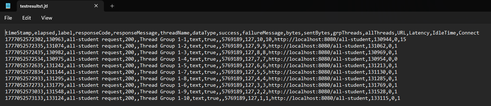

- `/all-student-name`

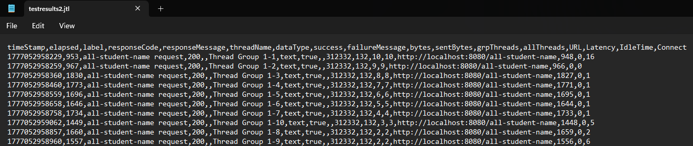

- `/highest-gpa`

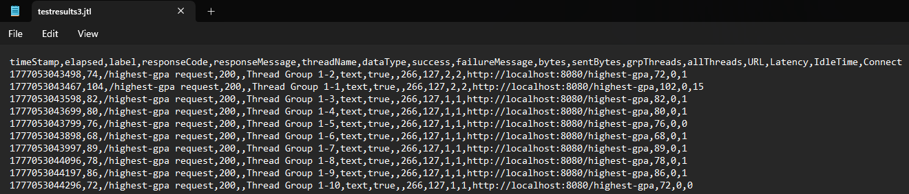

### Performance Tests After Optimized

- `/all-student`

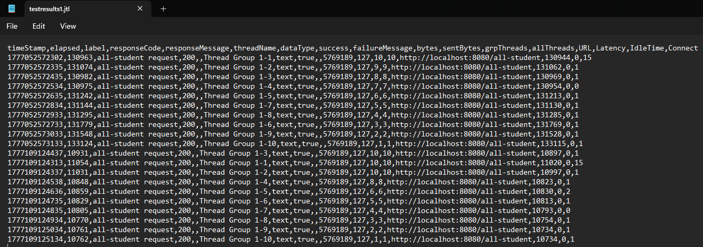

- `/all-student-name`

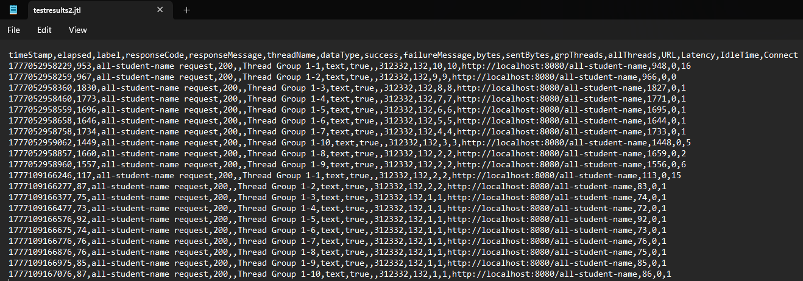

- `/highest-gpa`

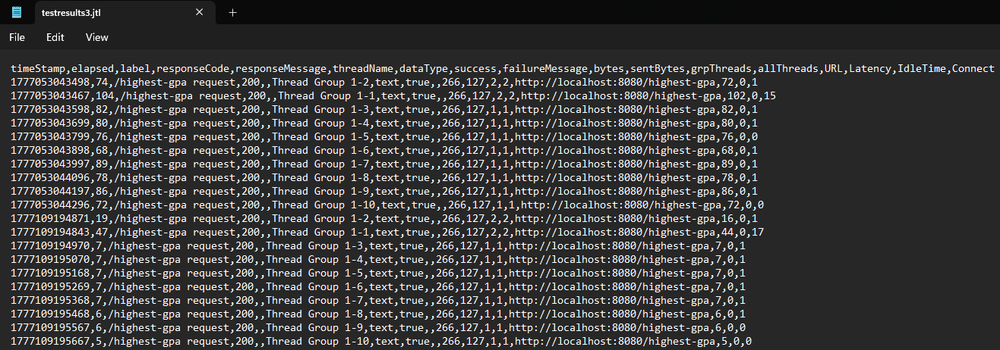

### Profiling Before Optimized

- `getAllStudentsWithCourses()`

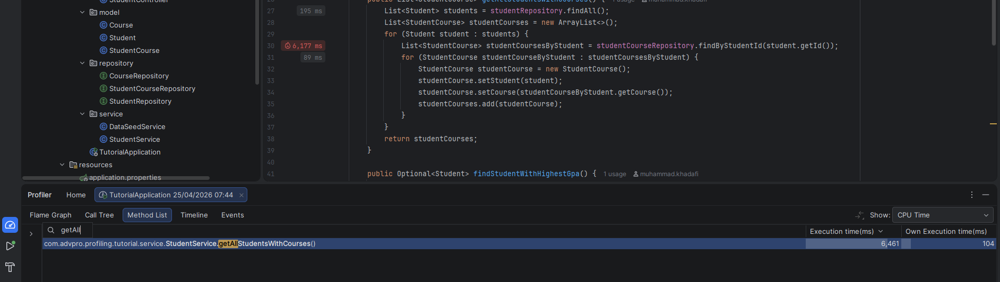

- `joinStudentNames()`

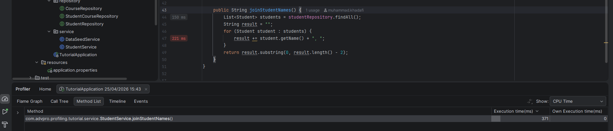

- `findStudentWithHighestGpa()`

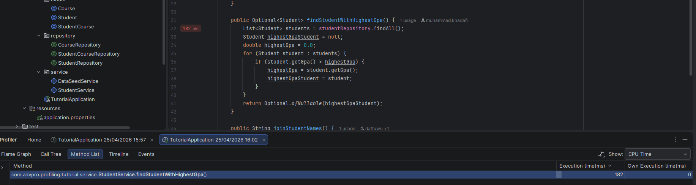

### Profiling After Optimized

- `getAllStudentsWithCourses()`

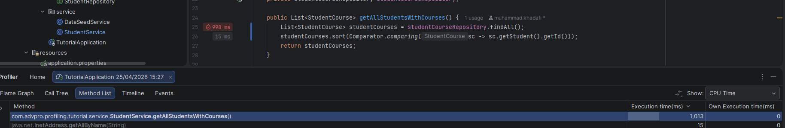

- `joinStudentNames()`

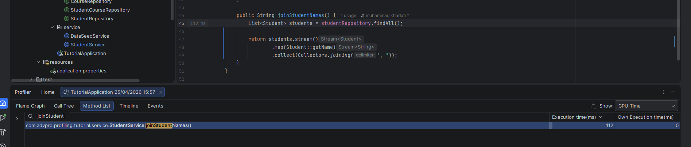

- `findStudentWithHighestGpa()`

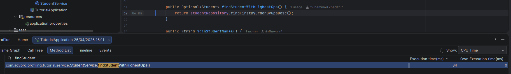

